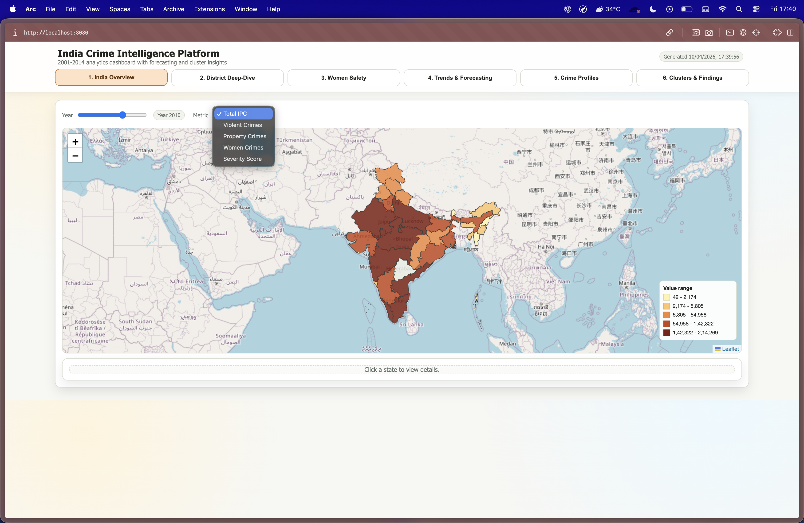
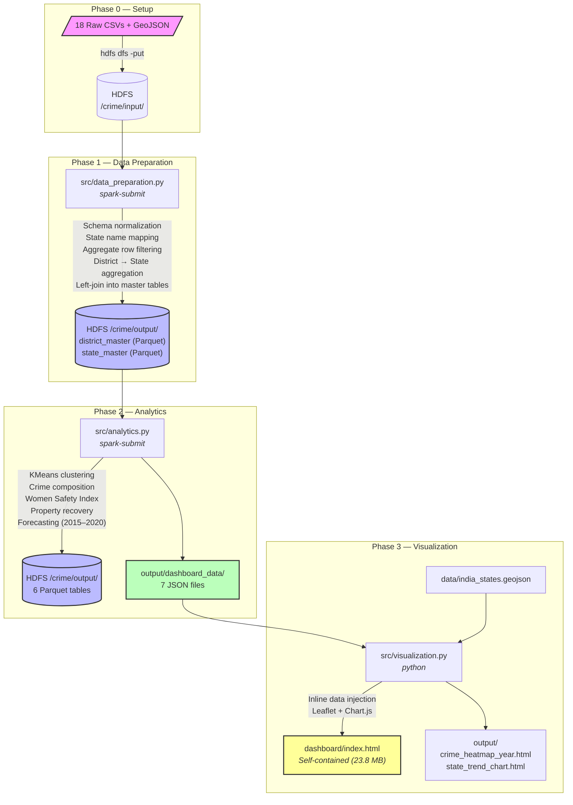
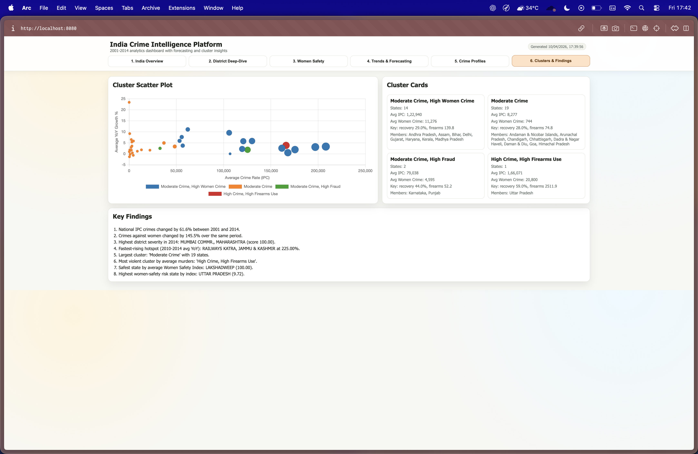
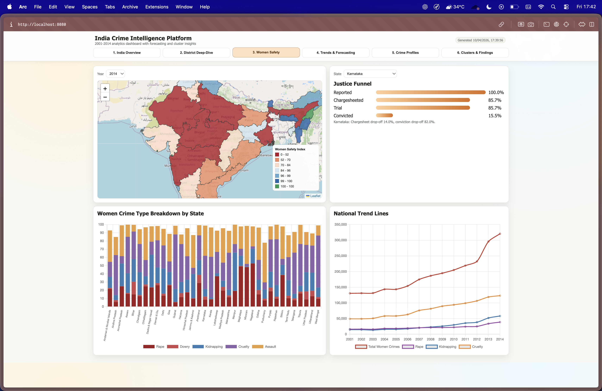
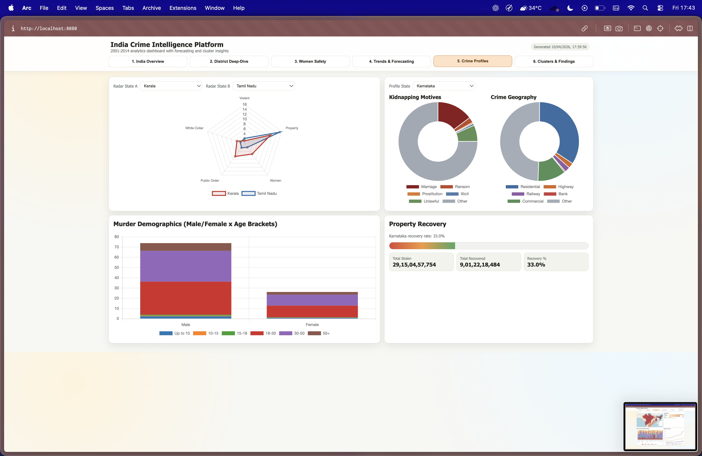

<p align="center">
  
</p>

<h1 align="center">🔍 India Crime Intelligence Platform</h1>

<p align="center">
  <strong>A PySpark-powered big data pipeline for analyzing 14 years of India crime statistics</strong>
</p>

<p align="center">
  
  
  
  
  
  
  
  
</p>

---

## 📋 Table of Contents

- [Overview](#-overview)
- [Architecture](#-architecture)
- [Data Flow](#-data-flow)
- [Tech Stack](#-tech-stack)
- [Datasets](#-datasets)
- [Prerequisites](#-prerequisites)
- [Installation & Setup](#-installation--setup)
- [How to Run](#-how-to-run)
- [Dashboard](#-dashboard)
- [HDFS Paths Reference](#-hdfs-paths-reference)
- [Key Design Patterns](#-key-design-patterns)
- [Project Structure](#-project-structure)

---

## 🌐 Overview

The **India Crime Intelligence Platform** ingests **18 CSV datasets** published by the [National Crime Records Bureau (NCRB)](https://ncrb.gov.in/) spanning **2001–2014**, processes them through a four-phase Hadoop/Spark pipeline, and produces a **self-contained interactive HTML dashboard** with six analytical views.

### What it does

| Capability | Description |
|---|---|
| **Data Ingestion** | Reads 18 heterogeneous CSVs from HDFS, normalizes schemas across three different eras (2001–2012, 2013, 2014), standardizes state names, and joins everything into master Parquet tables |
| **ML Analytics** | KMeans clustering with silhouette-based k selection, crime composition analysis, Women Safety Index, property recovery analysis, and state-wise forecasting (2015–2020) |
| **Forecasting** | Model selection between Ridge polynomial regression and GradientBoostingRegressor with TimeSeriesSplit cross-validation for each state |
| **Visualization** | Generates a single 23.8 MB self-contained HTML dashboard with Leaflet choropleth maps, Chart.js charts, and six interactive tabs |

---

## 🏗 Architecture

The pipeline is organized into **four sequential phases**:



---

## 🔄 Data Flow

```
data/*.csv
  │
  ▼
HDFS /crime/input/                          ← Phase 0: Manual upload
  │
  ▼
src/data_preparation.py (spark-submit)      ← Phase 1: Ingest, clean, join
  │
  ├──▶ HDFS /crime/output/district_master   (Parquet)
  └──▶ HDFS /crime/output/state_master      (Parquet)
         │
         ▼
src/analytics.py (spark-submit)             ← Phase 2: ML & analytics
  │
  ├──▶ HDFS /crime/output/clustered_crime_data      (Parquet)
  ├──▶ HDFS /crime/output/state_crime_time_series    (Parquet)
  ├──▶ HDFS /crime/output/model_report               (Parquet)
  ├──▶ HDFS /crime/output/women_safety_index          (Parquet)
  ├──▶ HDFS /crime/output/crime_composition           (Parquet)
  ├──▶ HDFS /crime/output/property_recovery_analysis  (Parquet)
  ├──▶ HDFS /crime/output/cluster_labels              (Parquet)
  │
  └──▶ output/dashboard_data/
         ├── national_trends.json
         ├── district_analysis.json
         ├── women_safety.json
         ├── forecasts.json
         ├── crime_profiles.json
         ├── clusters.json
         └── supplementary.json
              │
              ▼
src/visualization.py (python)           ← Phase 3: Dashboard generation
  │
  ├──▶ dashboard/index.html                 (Self-contained, 23.8 MB)
  ├──▶ output/crime_heatmap_year.html       (Folium choropleth)
  └──▶ output/state_trend_chart.html        (Chart.js state trends)
```

---

## 🛠 Tech Stack

| Layer | Technology | Purpose |
|---|---|---|
| **Distributed Storage** | Hadoop HDFS | Stores raw CSVs, intermediate Parquet, and analytics output |
| **Processing Engine** | Apache Spark 3.5.3 (PySpark) | Distributed data ingestion, cleaning, joins, and aggregation |
| **Machine Learning** | Spark MLlib + scikit-learn | KMeans clustering (MLlib), Ridge regression & GBR forecasting (sklearn) |
| **Data Wrangling** | Pandas, NumPy | Local-mode analytics, numerical operations |
| **Geospatial** | Folium + Leaflet.js | Interactive choropleth heatmaps |
| **Charting** | Chart.js | Bar, line, and radar charts in the dashboard |
| **Dashboard** | HTML + CSS + JavaScript | Single self-contained file with inline data and six interactive tabs |
| **Language** | Python 3 | End-to-end pipeline |

---

## 📊 Datasets

All 18 datasets are sourced from the **National Crime Records Bureau (NCRB)** of India.

| # | File | Description | Time Span |
|---|---|---|---|
| 1 | `01_District_wise_crimes_committed_IPC_2001_2012.csv` | IPC crimes by district | 2001–2012 |
| 2 | `01_District_wise_crimes_committed_IPC_2013.csv` | IPC crimes by district | 2013 |
| 3 | `01_District_wise_crimes_committed_IPC_2014.csv` | IPC crimes by district | 2014 |
| 4 | `10_Property_stolen_and_recovered.csv` | Property theft & recovery stats | 2001–2014 |
| 5 | `17_Crime_by_place_of_occurrence_2001_2012.csv` | Crime location analysis | 2001–2012 |
| 6 | `17_Crime_by_place_of_occurrence_2013.csv` | Crime location analysis | 2013 |
| 7 | `17_Crime_by_place_of_occurrence_2014.csv` | Crime location analysis | 2014 |
| 8 | `30_Auto_theft.csv` | Vehicle theft statistics | 2001–2014 |
| 9 | `31_Serious_fraud.csv` | Fraud case data | 2001–2014 |
| 10 | `32_Murder_victim_age_sex.csv` | Murder victim demographics | 2001–2014 |
| 11 | `33_CH_not_murder_victim_age_sex.csv` | Culpable homicide victim demographics | 2001–2014 |
| 12 | `34_Use_of_fire_arms_in_murder_cases.csv` | Firearm usage in murders | 2001–2014 |
| 13 | `39_Specific_purpose_of_kidnapping_and_abduction.csv` | Kidnapping motives | 2001–2014 |
| 14 | `42_Cases_under_crime_against_women.csv` | Crimes against women (state-level) | 2001–2014 |
| 15 | `42_District_wise_crimes_committed_against_women_2001_2012.csv` | Crimes against women by district | 2001–2012 |
| 16 | `42_District_wise_crimes_committed_against_women_2013.csv` | Crimes against women by district | 2013 |
| 17 | `42_District_wise_crimes_committed_against_women_2014.csv` | Crimes against women by district | 2014 |
| 18 | `india_states.geojson` | India state/UT boundary polygons | — |

---

## ✅ Prerequisites

| Requirement | Version | Notes |
|---|---|---|
| **Java** | 11 | Required by Spark — set `JAVA_HOME` |
| **Apache Spark** | 3.5.3 | With PySpark; set `SPARK_HOME` |
| **Hadoop HDFS** | 3.x | Running locally on `hdfs://localhost:9000` |
| **Python** | 3.x | 3.10+ recommended |

### Python Dependencies

```
pyspark==3.5.1
pandas==2.2.2
numpy==1.26.4
folium==0.16.0
branca==0.7.1
scikit-learn          # Required by analytics (Ridge, GBR, TimeSeriesSplit)
```

> ⚠️ **Note:** `scikit-learn` is used in the analytics phase but is currently missing from `requirements.txt`. Install it manually.

---

## 📦 Installation & Setup

### 1. Clone the repository

```bash
git clone https://github.com/aritra0309/hadoop-crime-project
cd hadoop-crime-project
```

### 2. Install Python dependencies

```bash
pip install -r requirements.txt
pip install scikit-learn   # Not listed in requirements.txt but required
```

### 3. Verify Spark and Hadoop

```bash
# Confirm Spark is available
spark-submit --version

# Confirm HDFS is running
hdfs dfs -ls /
```

### 4. Set up HDFS directories (Phase 0)

```bash
# Create input/output directories
hdfs dfs -mkdir -p /crime/input
hdfs dfs -mkdir -p /crime/output

# Upload all CSV datasets to HDFS
hdfs dfs -put data/*.csv /crime/input/

# Verify upload
hdfs dfs -ls /crime/input/
```

---

## 🚀 How to Run

Execute the pipeline phases **in order**:

### Phase 1 — Data Preparation

Ingests 18 CSVs from HDFS, normalizes schemas, standardizes state names, filters aggregate rows, and writes master Parquet tables.

```bash
spark-submit \
  --master local[*] \
  src/data_preparation.py
```

**Outputs:**
- `hdfs:///crime/output/district_master` (Parquet)
- `hdfs:///crime/output/state_master` (Parquet)

### Phase 2 — Analytics

Runs KMeans clustering, crime composition analysis, Women Safety Index, property recovery analysis, and state-wise forecasting.

```bash
spark-submit \
  --master local[*] \
  src/analytics.py
```

**Outputs:**
- 6 Parquet tables on HDFS (see [HDFS Paths Reference](#-hdfs-paths-reference))
- 7 JSON files in `output/dashboard_data/`

### Phase 3 — Visualization

Reads the 7 JSON files and GeoJSON, then generates the self-contained HTML dashboard.

```bash
python src/visualization.py
```

**Outputs:**
- `dashboard/index.html` — Main interactive dashboard (23.8 MB, self-contained)
- `output/crime_heatmap_year.html` — Standalone Folium choropleth heatmap
- `output/state_trend_chart.html` — Standalone Chart.js state trend chart

### View the Dashboard

```bash
open dashboard/index.html
# or
python -m http.server 8080 --directory dashboard/
# then visit http://localhost:8080
```

---

## 📈 Dashboard

The dashboard is a **single self-contained HTML file** (~23.8 MB) with all data, styles, and scripts inlined. No server required — just open it in a browser.

### 📸 Dashboard Screenshots

<table>
  <tr>
    <td align="center"><strong>🗺️ National Overview — Choropleth Heatmap</strong></td>
    <td align="center"><strong>👩 Women Safety Index</strong></td>
  </tr>
  <tr>
    <td></td>
    <td></td>
  </tr>
  <tr>
    <td align="center"><strong>📈 Trends & Forecasting</strong></td>
    <td align="center"><strong>🧬 Crime Profiles & Property Recovery</strong></td>
  </tr>
  <tr>
    <td></td>
    <td></td>
  </tr>
</table>

### Six Interactive Tabs

| Tab | Features |
|---|---|
| 🏠 **National Overview** | Year-over-year national crime trends, total IPC crime line charts, crime rate per capita |
| 📍 **District Hotspots** | Interactive choropleth heatmap with year selector, top-N district ranking |
| 👩 **Women Safety** | Women Safety Index ranking across states, crimes-against-women breakdown by type |
| 🔮 **Forecasting** | State-wise crime forecasts (2015–2020) with model confidence metrics, Ridge vs GBR model selection |
| 🧬 **Crime Profiles** | Crime type composition breakdown per state (percentage radar/bar charts) |
| 🎯 **Clustering** | KMeans cluster visualization, state groupings by crime similarity across 12 features |

### Key Visualizations
- **Leaflet choropleth maps** with interactive tooltips and year-based filtering
- **Chart.js** line, bar, and radar charts with hover interactivity
- **Per-state drill-down** for trend analysis and crime composition

---

## 💾 HDFS Paths Reference

| Path | Format | Written By | Description |
|---|---|---|---|
| `/crime/input/` | CSV | Manual upload | 18 raw NCRB datasets |
| `/crime/output/district_master` | Parquet | Phase 1 (data_preparation) | Joined district-level master table |
| `/crime/output/state_master` | Parquet | Phase 1 (data_preparation) | Joined state-level master table |
| `/crime/output/clustered_crime_data` | Parquet | Phase 2 (analytics) | States with cluster assignments |
| `/crime/output/state_crime_time_series` | Parquet | Phase 2 (analytics) | State-level time series data |
| `/crime/output/model_report` | Parquet | Phase 2 (analytics) | Forecasting model metrics & selection |
| `/crime/output/women_safety_index` | Parquet | Phase 2 (analytics) | Women Safety Index scores |
| `/crime/output/crime_composition` | Parquet | Phase 2 (analytics) | Crime type % breakdown by state |
| `/crime/output/property_recovery_analysis` | Parquet | Phase 2 (analytics) | Stolen vs recovered property stats |
| `/crime/output/cluster_labels` | Parquet | Phase 2 (analytics) | KMeans cluster label metadata |

---

## 🧩 Key Design Patterns

### 1. State Name Standardization

Indian state names appear with many variant spellings across NCRB datasets. The pipeline uses a two-layer mapping system in `src/state_mapping.py`:

```
Raw Data → STATE_NAME_MAP → Canonical UPPERCASE → CANONICAL_TO_GEOJSON → GeoJSON NAME_1
```

- **`STATE_NAME_MAP`** — Maps ~15 variant spellings (e.g., `"A & N ISLANDS"`, `"A&N ISLANDS"`, `"ANDAMAN & NICOBAR"`) to canonical names (e.g., `"ANDAMAN & NICOBAR ISLANDS"`)
- **`CANONICAL_TO_GEOJSON`** — Maps canonical names to GeoJSON `NAME_1` values, which use `"and"` instead of `"&"` and older names like `"Orissa"` and `"Uttaranchal"`

### 2. Schema Normalization

Each dataset era (2001–2012, 2013, 2014) uses different column headers for the same data. The pipeline handles this with:

- **`normalize_*_df()`** functions that rename columns to a unified schema
- **`safe_select()`** that fills missing columns with zeros, ensuring all DataFrames have consistent shapes before joins

### 3. Aggregate Row Filtering

Raw NCRB data includes summary rows like `"TOTAL (ALL-INDIA)"` and `"TOTAL DISTRICT(S)"`. These are filtered out using:

- **`AGGREGATE_STATE_PATTERNS`** — Regex patterns matching national-level totals
- **`AGGREGATE_DISTRICT_PATTERNS`** — Regex patterns matching district-level totals

### 4. Spark Configuration

- `spark.sql.shuffle.partitions = 4` — Tuned for local execution
- `.coalesce(1)` on all outputs — Ensures single-file Parquet partitions for easy downstream consumption

### 5. Forecasting Model Selection

For each state's crime forecast, the pipeline:
1. Fits both **Ridge polynomial regression** and **GradientBoostingRegressor**
2. Evaluates with **TimeSeriesSplit** cross-validation
3. Selects the model with the lowest CV error
4. Generates forecasts for 2015–2020 with confidence metrics

### 6. KMeans Cluster Selection

Uses Spark MLlib's KMeans with **silhouette score** evaluation across multiple k values to automatically select the optimal number of clusters from 12 crime features.

---

## 📁 Project Structure

```
hadoop-crime-project/
│
├── 📂 data/                                    # Raw NCRB datasets + geospatial data
│   ├── 01_District_wise_crimes_committed_IPC_2001_2012.csv
│   ├── 01_District_wise_crimes_committed_IPC_2013.csv
│   ├── 01_District_wise_crimes_committed_IPC_2014.csv
│   ├── 10_Property_stolen_and_recovered.csv
│   ├── 17_Crime_by_place_of_occurrence_2001_2012.csv
│   ├── 17_Crime_by_place_of_occurrence_2013.csv
│   ├── 17_Crime_by_place_of_occurrence_2014.csv
│   ├── 30_Auto_theft.csv
│   ├── 31_Serious_fraud.csv
│   ├── 32_Murder_victim_age_sex.csv
│   ├── 33_CH_not_murder_victim_age_sex.csv
│   ├── 34_Use_of_fire_arms_in_murder_cases.csv
│   ├── 39_Specific_purpose_of_kidnapping_and_abduction.csv
│   ├── 42_Cases_under_crime_against_women.csv
│   ├── 42_District_wise_crimes_committed_against_women_2001_2012.csv
│   ├── 42_District_wise_crimes_committed_against_women_2013.csv
│   ├── 42_District_wise_crimes_committed_against_women_2014.csv
│   └── india_states.geojson                    # State/UT boundary polygons (36 regions)
│
├── 📂 src/                                     # Core Python modules
│   ├── __init__.py
│   ├── data_preparation.py                     # Phase 1: Ingestion, cleaning, joins (877 lines)
│   ├── analytics.py                            # Phase 2: ML analytics engine (1187 lines)
│   ├── state_mapping.py                        # STATE_NAME_MAP + CANONICAL_TO_GEOJSON (214 lines)
│   └── utils.py                                # Shared utilities & helpers (145 lines)
│
├── 📂 src/                                 # Pipeline entry points
│   ├── data_preparation.py                     # spark-submit entry for Phase 1 (589 lines)
│   ├── analytics.py                            # spark-submit entry for Phase 2 (575 lines)
│   └── visualization.py                        # Phase 3: Dashboard HTML generation (1571 lines)
│
├── 📂 docs/                                     # Documentation assets
│   └── screenshots/                            # Dashboard screenshots (4 images)
│       ├── 01_national_overview.png
│       ├── 02_women_safety.png
│       ├── 03_trends_forecasting.png
│       └── 04_crime_profiles.png
│
├── 📂 dashboard/                               # Generated dashboard output
│   ├── index.html                              # Self-contained interactive dashboard (23.8 MB)
│   └── assets/
│       └── dashboard_screenshot.svg            # Dashboard preview image
│
├── 📂 output/                                  # Pipeline outputs
│   ├── dashboard_data/                         # 7 JSON files for visualization
│   │   ├── national_trends.json
│   │   ├── district_analysis.json
│   │   ├── women_safety.json
│   │   ├── forecasts.json
│   │   ├── crime_profiles.json
│   │   ├── clusters.json
│   │   └── supplementary.json
│   ├── crime_heatmap_year.html                 # Standalone Folium choropleth
│   ├── state_trend_chart.html                  # Standalone Chart.js trend chart
│   └── cleaned_ipc_crime_data/                 # Spark CSV output partitions
│
├── requirements.txt                            # Python dependencies
├── CLAUDE.md                                   # AI assistant context
├── WORKFLOW.md                                 # Development workflow notes
└── README.md                                   # ← You are here
```

---

## 📄 License

This project uses publicly available data from the [National Crime Records Bureau (NCRB)](https://ncrb.gov.in/), Government of India.

---
---

###  Done by Aritra Sarkar, Varshin s and Shaheen Ali
