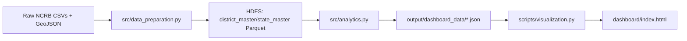
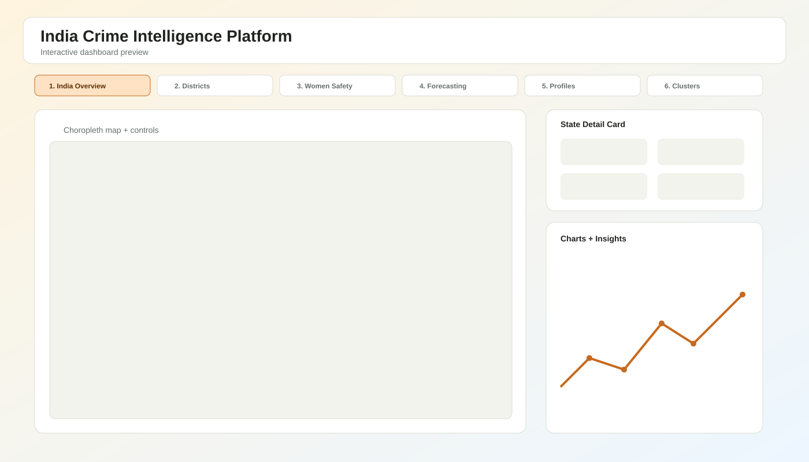

# India Crime Intelligence Platform

PySpark-based analytics platform over 15 NCRB datasets (2001-2014) with a self-contained interactive dashboard (`dashboard/index.html`) covering national overview, district hotspots, women safety, forecasting, crime profiles, and clustering insights.

## Architecture


## How To Run
1. Ensure Hadoop + Spark are running and HDFS is accessible at `hdfs://localhost:9000`.
2. Put CSV inputs in `data/`.
3. Run Phase 1 preparation:
   ```bash
   python3 src/data_preparation.py
   ```
4. Run Phase 2 analytics:
   ```bash
   python3 src/analytics.py
   ```
5. Generate dashboard HTML (Phase 4):
   ```bash
   python3 scripts/visualization.py
   ```
6. Open:
   - `dashboard/index.html`

## Datasets Used
- `01_District_wise_crimes_committed_IPC_2001_2012.csv`
- `01_District_wise_crimes_committed_IPC_2013.csv`
- `01_District_wise_crimes_committed_IPC_2014.csv`
- `42_District_wise_crimes_committed_against_women_2001_2012.csv`
- `42_District_wise_crimes_committed_against_women_2013.csv`
- `42_District_wise_crimes_committed_against_women_2014.csv`
- `42_Cases_under_crime_against_women.csv`
- `10_Property_stolen_and_recovered.csv`
- `30_Auto_theft.csv`
- `31_Serious_fraud.csv`
- `32_Murder_victim_age_sex.csv`
- `33_CH_not_murder_victim_age_sex.csv`
- `34_Use_of_fire_arms_in_murder_cases.csv`
- `39_Specific_purpose_of_kidnapping_and_abduction.csv`
- `17_Crime_by_place_of_occurrence_2001_2012.csv`
- `17_Crime_by_place_of_occurrence_2013.csv`
- `17_Crime_by_place_of_occurrence_2014.csv`
- `india_states.geojson`

## Dashboard Screenshot


## Tech Stack
- Python 3
- PySpark (Spark SQL + MLlib)
- NumPy / Pandas / scikit-learn
- HTML + CSS + JavaScript
- Chart.js
- Leaflet
