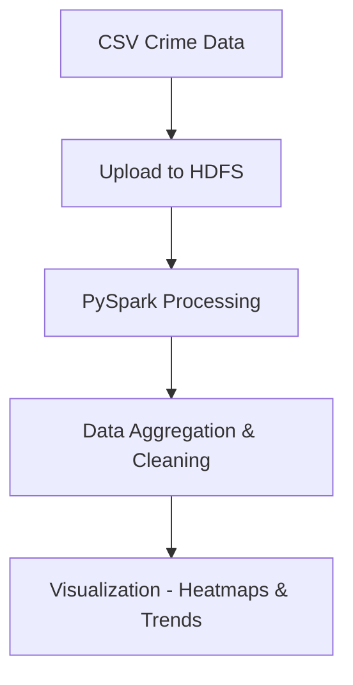

# Hadoop Crime Analysis Project


A big data pipeline that analyzes multi-year crime datasets using the Hadoop ecosystem.  
The project demonstrates distributed data storage, large-scale processing with PySpark, and geographic crime visualization.

---

# Overview

Crime datasets across multiple years and districts can become too large to process efficiently using traditional tools.

This project uses the **Hadoop ecosystem** to process and analyze large crime datasets by:

- Storing raw data in **HDFS**
- Processing data using **PySpark**
- Aggregating crime statistics across states and districts
- Visualizing crime trends using heatmaps and charts

The result is a scalable pipeline capable of analyzing large crime datasets efficiently.

---

# Problem Statement

Crime data is often spread across multiple files and years. Traditional analysis tools struggle to efficiently process and visualize large datasets.

This project demonstrates how **distributed computing frameworks like Hadoop and Spark can be used to efficiently process large crime datasets and generate meaningful insights.**

---

# Dataset

The dataset consists of multiple CSV files containing crime statistics across Indian states and districts over multiple years.

Typical attributes include:

- **State**
- **District**
- **Year**
- **Crime Type**
- **Number of Cases**

The raw CSV datasets are uploaded to **HDFS** before being processed by PySpark.

---

# Tech Stack

### Languages
- Python

### Big Data Technologies
- Apache Hadoop
- HDFS
- PySpark

### Data Processing
- Pandas

### Visualization
- Folium
- Interactive heatmaps

---

# Project Architecture



---

# Project Structure

```
hadoop-crime-project/
│
├── data/                  # Raw crime datasets
│
├── scripts/
│   ├── preprocessing.py   # Data cleaning and preparation
│   ├── analysis.py        # Crime data aggregation
│   └── visualization.py   # Heatmap and visualization generation
│
├── output/                # Processed datasets
│
├── notebooks/             # Optional exploratory analysis
│
└── README.md
```

---

# Features

- Multi-year crime dataset processing
- Distributed data storage using HDFS
- Parallel data processing with PySpark
- Aggregation of crime statistics by district and year
- Interactive geographic heatmap visualization
- Crime trend analysis over time

---

# Setup Instructions

## 1. Clone the Repository

```bash
git clone https://github.com/aritra0309/hadoop-crime-project.git
cd hadoop-crime-project
```

---

## 2. Start Hadoop

```bash
start-dfs.sh
start-yarn.sh
```

---

## 3. Upload Data to HDFS

```bash
hdfs dfs -mkdir /crime-data
hdfs dfs -put data/*.csv /crime-data
```

---

## 4. Run Data Processing

```bash
python scripts/data_preparation.py
```

---
## 5. Run Analysis

```bash
python scripts/analytics.py
```

---

## 5. Generate Visualization

```bash
python scripts/visualization.py
```

This generates **interactive crime heatmaps and trend visualizations.**

---

# Results

The pipeline produces:

- Aggregated crime statistics
- District-level crime distribution
- Year-wise crime trends
- Interactive geographic crime heatmaps

These visualizations help identify **crime hotspots and long-term patterns.**

---

# Future Improvements

- Machine learning for crime prediction
- Interactive dashboard using Streamlit or Dash
- Real-time crime data processing
- Deployment on a distributed Hadoop cluster

---

# Author

**Aritra**

GitHub  
https://github.com/aritra0309
